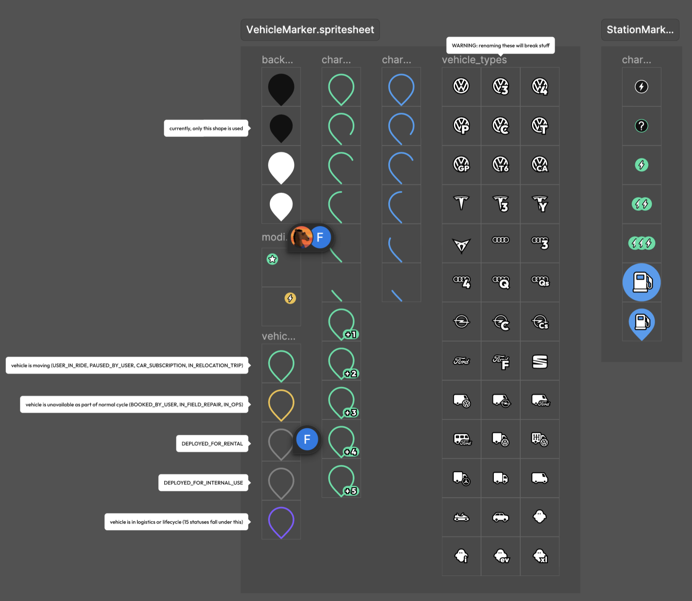
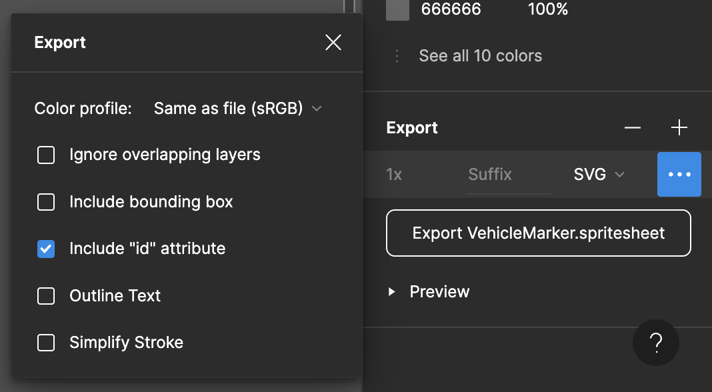

# vorfahrt-vienna

assets related to the vorfahrt project.

takes figma exports of vorfahrt stylesheets (figma sections structured and exported in a specific manner), and creates png and svg variants of every possible kind of map marker.

## usage examples

### using v0.1.0
```
import findIcon from "@koenidv/vorfahrt-vienna";

const tags = [
  "VW ID.3",
  "discounted",
  "electric_plus3"
];
const icon = findIcon("png", tags);
```

for now, please look up possible tags in figma. every included component name is a tag.

### using [Next.js Local Image Imports](https://nextjs.org/docs/app/building-your-application/optimizing/images#local-images)


```ts
/**
 * using the pre-built markers
 */
import { Marker } from "@koenidv/vorfahrt-vienna";

const vehicleMarker = Marker.Vehicle["VW Polo GP 2022"].deployed_for_rental.fuel_30;

export default function Page() {

    return ;
}
```

```ts
/**
 * assembling the primitives yourself
 */
import { SpriteSheet } from "@koenidv/vorfahrt-vienna";

const markerBackground = SpriteSheet.VehicleMarker.backgrounds.black_without_border;
const vwPoloIcon = SpriteSheet.VehicleMarker.vehicle_type["VW Polo GP 2022"];

export default function Page() {

    return <div style={{ position: "relative" }}>
        
        
    </div>;
}
```

```ts
/**
 * usage as markers with the google maps sdk
 */
import { Marker } from "@koenidv/vorfahrt-vienna";

const marker = new google.maps.Marker({

  /* ... */

  icon: {
    url: Marker.Vehicle["VW Polo GP 2022"].deployed_for_rental.fuel_30.src,

    scaledSize: new google.maps.Size(40, 40),
  }
});
```

## spritesheet requirements



### figma section named as *.spritesheet

### ALL sprites must have a visible stroke

### figma export



can't be renamed, must have the same name as the stylesheet section
text must be outlined beforehand

| export option               | required value      |
|-----------------------------|---------------------|
| `Ignore overlapping layers` | irrelevant          |
| `Include bounding box`      | irrelevant          |
| `Include "id" attribute`    | must be checked     |
| `Outline Text`              | irrelevant          |
| `Simplify Stroke`           | must NOT be checked |